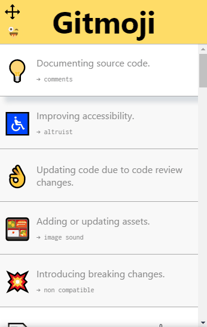
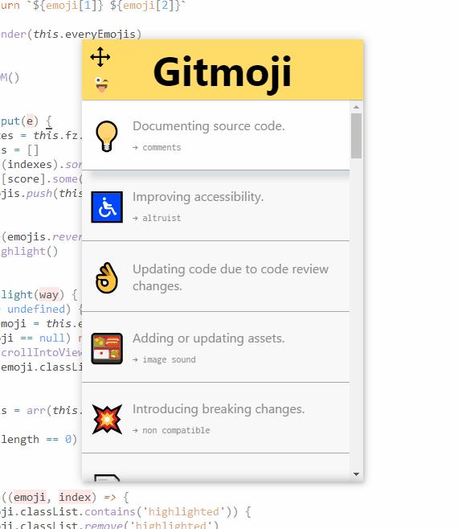

# Gitmoji Cheat Sheet

This is a little window build with electron that lists the emoji you should use in your commit
messages, with a fuzzy search feature. I use exactly the same text and emoji from
[gitmoji.carloscuesta.me/][].

There's still some stuff that can be improved, but here's how it looks for now:





[gitmoji.carloscuesta.me/]: https://gitmoji.carloscuesta.me/

## Run

```bash
$ yarn global add electron # npm install -g electron
$ git clone https://github.com/math2001/gitmoji-cheat-sheet
$ cd gitmoji-cheat-sheet
$ yarn # npm install
$ electron .
```
